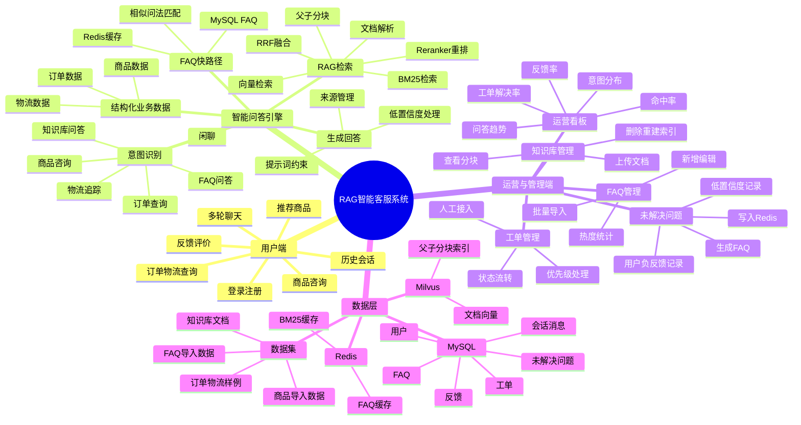

# RAG 智能客服问答系统

这是一个面向电商售后场景的 RAG 智能客服系统，支持用户登录、多轮问答、知识库检索、FAQ 高频问答、商品咨询、订单物流查询、人工工单、未解决问题沉淀和运营看板分析。

系统核心目标不是只做“文档问答”，而是把 RAG、FAQ、结构化业务数据和客服运营流程组合起来，让问答结果更接近真实智能客服。

## 项目亮点

- 登录后才能聊天，支持普通用户、客服、管理员等角色。
- 支持 WebSocket 流式问答，前端有真实聊天窗口、历史会话和推荐商品侧栏。
- 支持知识库上传，后端会进行文档解析、父子分块、向量化和检索。
- 支持 FAQ 高频问答，命中后优先走 Redis/MySQL 快速返回。
- 支持未解决问题沉淀，可以直接生成可命中的 FAQ，并同步写入 Redis 缓存。
- 支持商品结构化问答，点击推荐商品后可回答价格、库存、规格、退换货、售后等问题，并支持追问。
- 支持订单和物流查询，能根据上下文处理“这个商品”“第一个商品”等追问。
- 支持运营看板，展示问答量、意图分布、FAQ 热度、未解决问题、反馈和工单指标。

## 技术栈

| 模块 | 技术 |
| --- | --- |
| 前端 | React 18、TypeScript、Vite、Ant Design、Zustand、ECharts |
| 后端 | FastAPI、Python、SQLAlchemy、WebSocket |
| 向量检索 | Milvus、BGE-M3、BGE-Reranker |
| 关键词检索 | BM25 |
| 缓存 | Redis |
| 关系数据库 | MySQL |
| 大模型 | OpenAI-compatible API，可配置 DeepSeek、Qwen 等 |
| 知识库处理 | LlamaIndex、文档解析、父子分块 |

## 系统思维导图



## 核心流程

### 1. 用户问答流程

```text
用户输入问题
  -> 登录鉴权
  -> 保存用户消息
  -> 安全检查
  -> 商品/订单追问识别
  -> FAQ 缓存命中检查
  -> 意图识别
  -> 选择问答策略
  -> 检索知识库或业务数据
  -> 生成回答
  -> 保存助手消息
  -> 返回前端流式展示
```

### 2. FAQ 快速命中流程

```text
用户问题
  -> Redis FAQ 缓存
  -> MySQL FAQ 精确匹配
  -> FAQ 相似问法/语义匹配
  -> 命中则直接返回
  -> 未命中再进入 RAG 检索或其他业务流程
```

### 3. 知识库上传流程

```text
管理端上传文档
  -> 文件解析
  -> 文本清洗
  -> 父块切分
  -> 子块切分
  -> 向量化
  -> 写入 Milvus
  -> 重建 BM25 索引
```

### 4. 未解决问题转 FAQ 流程

```text
低置信度问题 / 用户负反馈
  -> 记录到未解决问题列表
  -> 运营人员编辑问题和标准答案
  -> 点击生成 FAQ
  -> 写入 MySQL FAQ
  -> 设置为 active 状态
  -> 主问题和相似问法写入 Redis
  -> 后续问答可直接命中 FAQ
```

## 功能模块

### 用户端

- 普通用户登录后才能进入聊天。
- 支持新建会话、切换历史会话、删除会话。
- 支持 WebSocket 流式输出。
- 支持右侧推荐商品咨询。
- 支持对回答进行有用/无用反馈。
- 支持订单、物流、商品售后等电商客服问题。

### 商品咨询

商品数据位于：

```text
datasets/product_import/product_import.json
datasets/product_import/product_import.csv
```

系统可回答：

- 商品价格
- 当前库存
- 规格参数
- 发货时效
- 保修政策
- 退换货规则
- 售后处理方式

点击推荐产品会自动发送带商品 ID 的咨询问题，后续可以继续追问“它能退吗”“保修多久”“还有库存吗”等。

### 知识库管理

知识库文档位于：

```text
datasets/knowledge_docs/
```

建议通过管理端上传，不建议直接写数据库。这样可以保留系统里的文档解析、父子分块、向量化、BM25 重建和来源追踪能力。

### FAQ 管理

FAQ 导入数据位于：

```text
datasets/faq_import.json
```

FAQ 支持：

- 新增、编辑、删除
- 批量导入
- 相似问法
- 状态管理
- Redis 缓存加速
- 高频问题统计

### 未解决问题管理

系统会把低置信度回答、用户负反馈等问题记录到未解决问题列表。运营人员可以在页面中编辑问题和答案，然后直接生成可命中的 FAQ。

当前生成 FAQ 后会：

- 写入 MySQL FAQ 表
- 设置 FAQ 状态为 `active`
- 主问题写入 Redis
- 相似问法写入 Redis
- 原未解决问题状态变为 `converted_to_faq`

### 运营看板

运营看板展示：

- 总问答量
- 平均响应耗时
- 命中率
- 意图分布
- 每日趋势
- 热门 FAQ
- 未解决问题排行
- 用户反馈比例
- 工单解决率
- 知识库索引统计

## 目录结构

```text
RAG/
├── backend/
│   ├── api/                  # FastAPI 路由
│   ├── business/             # 商品、订单、物流、工单等业务逻辑
│   ├── config/               # 配置文件
│   ├── middleware/           # 登录鉴权
│   ├── mysql_module/         # MySQL、Redis、FAQ、会话、工单 DAO
│   ├── offline_kb/           # 知识库离线索引
│   ├── rag_qa/               # RAG 问答主流程
│   └── utils/                # 加密、安全等工具
├── frontend/
│   ├── src/
│   │   ├── layouts/          # 主布局、管理端布局
│   │   ├── pages/            # 聊天、看板、FAQ、知识库、工单等页面
│   │   ├── services/         # API 请求封装
│   │   ├── stores/           # Zustand 状态管理
│   │   ├── types/            # TypeScript 类型
│   │   └── mock/             # 推荐商品前端数据
├── datasets/
│   ├── knowledge_docs/       # 知识库文档
│   ├── product_import/       # 商品导入数据
│   ├── faq_import.json       # FAQ 导入数据
│   └── structured_business_data.json
├── docs/                     # 开发文档和修改计划
└── README.md
```

## 启动方式

### 1. 启动基础服务

需要提前准备：

- MySQL
- Redis
- Milvus

示例：

```bash
# Redis
docker run -d --name redis -p 6379:6379 redis --requirepass 1234

# MySQL 创建数据库
mysql -u root -p -e "CREATE DATABASE IF NOT EXISTS rag_db CHARACTER SET utf8mb4;"
```

Milvus 可使用官方 standalone docker-compose 启动。

### 2. 后端启动

```bash
cd backend
pip install -r requirements.txt
python main.py
```

后端默认地址：

```text
http://localhost:8000
```

### 3. 前端启动

```bash
cd frontend
npm install
npm run dev
```

前端默认地址：

```text
http://localhost:5173
```

## 配置说明

后端配置通常放在：

```text
backend/config/.env
```

常用配置示例：

```env
MYSQL_HOST=127.0.0.1
MYSQL_PORT=3306
MYSQL_USER=root
MYSQL_PASSWORD=your_password

REDIS_URL=redis://:your_password@127.0.0.1:6379/0

MILVUS_HOST=127.0.0.1
MILVUS_PORT=19530

LLM_API_BASE=https://api.deepseek.com
LLM_API_KEY=your_api_key
LLM_MODEL=deepseek-chat

TAVILY_API_KEY=your_tavily_key
```

## 测试问题示例

### FAQ

- 退货政策是什么？
- 发票怎么开？
- 优惠券为什么不能用？

### 商品

- 星澜 X1 Pro 智能手机多少钱？
- 云听 AirBuds 5 拆封后还能退吗？
- 净源 A2 的滤芯多久换一次？
- 小鹿儿童学习平板激活后还能无理由退货吗？

### 追问

- 它还有库存吗？
- 保修多久？
- 这个多久发货？
- 能退货吗？

### 订单物流

- 我的订单到哪里了？
- 查询订单状态。
- 第一个商品什么时候发货？

## API 概览

| 方法 | 路径 | 说明 |
| --- | --- | --- |
| POST | `/api/chat` | 非流式问答 |
| WS | `/api/ws/chat` | WebSocket 流式问答 |
| GET | `/api/conversations` | 会话列表 |
| POST | `/api/conversations` | 新建会话 |
| GET | `/api/conversations/{id}/messages` | 会话消息 |
| POST | `/api/kb/upload` | 上传知识库文件 |
| GET | `/api/kb/list` | 知识库文档列表 |
| GET | `/api/kb/stats` | 知识库索引统计 |
| CRUD | `/api/faq` | FAQ 管理 |
| POST | `/api/faq/batch-import` | FAQ 批量导入 |
| GET | `/api/unresolved` | 未解决问题列表 |
| POST | `/api/unresolved/{id}/to-faq` | 未解决问题生成 FAQ |
| GET | `/api/tickets` | 工单列表 |
| GET | `/api/dashboard` | 运营看板 |
| GET/PUT | `/api/settings` | 系统配置 |

## 数据导入建议

- 知识库文档：通过管理端上传，让系统自动解析、切块、向量化。
- FAQ 数据：通过 FAQ 批量导入或未解决问题生成。
- 商品、订单、物流数据：作为结构化业务数据接入，不建议上传到知识库。

这样可以让知识库检索、FAQ 命中和业务查询各走适合自己的链路。

## 项目定位

这个项目适合作为“RAG + 智能客服 + 运营闭环”的综合项目展示，重点体现：

- RAG 检索增强生成能力
- FAQ 缓存加速能力
- 结构化业务数据问答能力
- 多角色权限和客服工单能力
- 未解决问题到 FAQ 的运营闭环
- 前后端完整工程化实现
